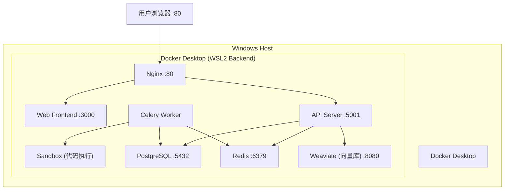

## 用户需求

在本地 Windows 11 D 盘部署 Dify AI 应用开发平台，使用 Docker Desktop 方案，全量部署所有组件，数据存放于 D:\dify 目录。

## 环境现状

- **系统**: Windows 11 家庭中文版 (Build 26200), x64, 32GB RAM
- **D 盘可用空间**: ~274GB
- **缺失依赖**: WSL 未安装, Docker 未安装
- **端口占用**: MangaManager 已占用 5000 (API) 和 5173 (前端)
- **目标目录**: D:\dify (不存在，需创建)

## 核心部署目标

1. 安装并配置 WSL2（限制内存 8GB，存储置于 D 盘）
2. 安装 Docker Desktop，配置数据目录到 D 盘
3. 克隆 Dify 源码到 D:\dify，拉取官方最新稳定版
4. 配置环境变量解决端口冲突，配置数据卷到 D 盘持久化
5. 启动全量服务组件：API、Web、Worker、Sandbox、PostgreSQL、Redis、Weaviate、Nginx
6. 验证所有服务正常运行并提供管理脚本

## 技术方案

### 架构概览

Dify 采用微服务容器化架构，通过 docker-compose 编排管理。本次部署在 Windows + Docker Desktop(WSL2) 环境下进行。

### 端口规划与冲突解决

| 服务 | Dify 默认端口 | 当前占用 | 调整方案 |
| --- | --- | --- | --- |
| Nginx (入口) | 80 | 无 | 保持 80 |
| API | 5001 | 无(5000被占用) | 保持 5001 |
| Web 前端 | 3000 | 无(5173被占用) | 保持 3000 |
| PostgreSQL | 5432 | 无 | 保持 5432 |
| Redis | 6379 | 无 | 保持 6379 |
| Weaviate | 8080 | 无 | 保持 8080 |
| Sandbox | 8194 | 无 | 保持 8194 |

MangaManager 的 5000/5173 与 Dify 的 5001/3000 无冲突，端口映射使用 Dify 默认值即可。

### 关键注意事项

1. **WSL2 内存限制**: 32GB 主机内存中，限制 WSL2 最多使用 8GB，为 MangaManager 和其他应用留足空间
2. **数据持久化**: docker-compose 中所有 named volumes 映射到 D 盘 `D:\dify\docker-volumes\`
3. **版本锁定**: 使用 Dify 稳定版标签而非 latest，避免意外升级
4. **Dify 版本**: 建议使用 v1.3.x 或更新稳定版